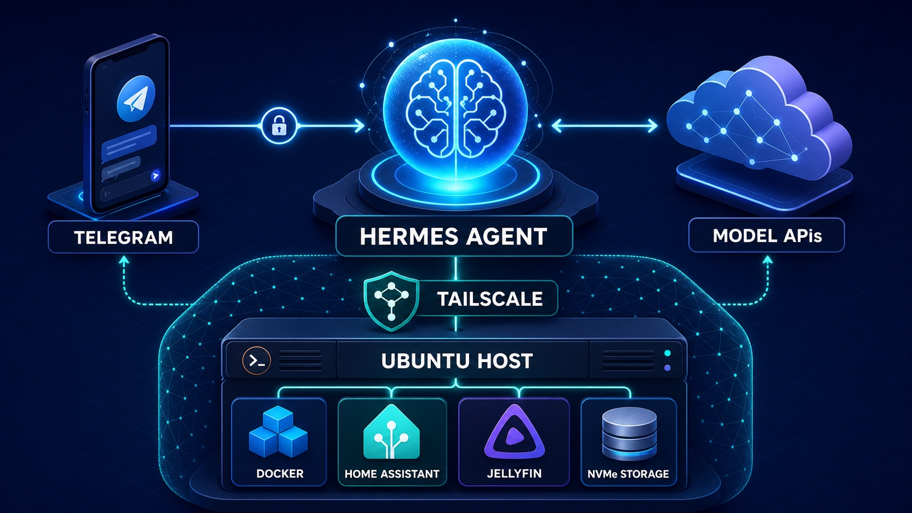
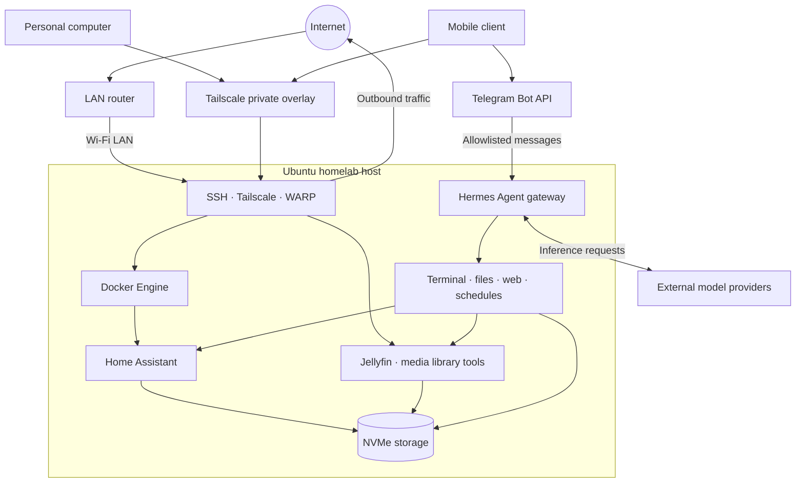

# Homelab

A compact, remote-access-first homelab built on repurposed consumer hardware. It runs home automation, media management, and private network services while providing a practical environment for learning Linux operations, containers, networking, and infrastructure security.

> This repository is a sanitized portfolio view of a live system. Host addresses, account names, device identifiers, credentials, and private configuration are intentionally excluded.

## At a glance

| Area | Implementation |
| --- | --- |
| Host | Dell Inspiron 14 5410 2-in-1 |
| Operating system | Ubuntu 22.04 LTS |
| Compute | 4-core / 8-thread Intel Core i7, 16 GB RAM |
| Storage | 512 GB NVMe, ext4 |
| Container runtime | Docker Engine |
| Remote access | Tailscale mesh VPN |
| Outbound network layer | Cloudflare WARP |
| Agent control plane | Hermes Agent through an allowlisted Telegram bot |
| Automation | Home Assistant |
| Media services | Jellyfin and supporting library tools |
| Maintenance | systemd, journald, unattended upgrades |

The server had been continuously available for more than 13 weeks when this documentation was generated in August 2026.

## Architecture

The design intentionally distinguishes between the physical LAN and the Tailscale overlay. Remote clients reach infrastructure services through the private tailnet, while Telegram provides the conversational control channel for Hermes Agent. Hermes is the system's orchestration layer: it interprets requests, maintains task context, and invokes tools against the host and connected services.

## Service model

Home Assistant runs as a long-lived Docker container using host networking. The media applications currently run as native user processes, while infrastructure components such as Docker, SSH, Tailscale, WARP, and unattended upgrades are managed by systemd.

| Service | Deployment | Responsibility |
| --- | --- | --- |
| Hermes Agent | Persistent systemd user service | Telegram-controlled agent and tool orchestration |
| Home Assistant | Docker container | Home automation and device orchestration |
| go2rtc | Home Assistant companion process | Camera and real-time media transport |
| Jellyfin | Native user process | Personal media streaming |
| Media library tooling | Native user processes | Library organization and supporting automation |
| Tailscale | system service | Authenticated private remote access |
| Cloudflare WARP | system service | Outbound network tunnel |
| OpenSSH | system service | Administrative access |

## Documentation

- [Architecture](docs/architecture.md)
- [Hermes Agent control plane](docs/hermes-agent.md)
- [Hardware and platform](docs/hardware.md)
- [Services](docs/services.md)
- [Networking](docs/networking.md)
- [Security posture](docs/security.md)
- [Operations](docs/operations.md)
- [Improvement roadmap](docs/roadmap.md)
- [Portfolio copy](docs/portfolio-copy.md)

## Engineering roadmap

The ongoing design work focuses on key-only administration, default-deny networking, encrypted off-host backups, least-privilege agent tooling, declarative services, and external monitoring. Live remediation status is intentionally kept private.

The target controls and sequencing are recorded in [Security architecture](docs/security.md) and [Improvement roadmap](docs/roadmap.md).

## Documentation method

This repository was created from a read-only inventory over SSH. Commands inspected system metadata, active services, container metadata, listeners, maintenance state, and a sanitized Tailscale peer summary. Secret-bearing files, application databases, environment variables, authentication material, and private service configuration were not collected.

## License

Documentation and diagrams are provided under the [MIT License](LICENSE).
