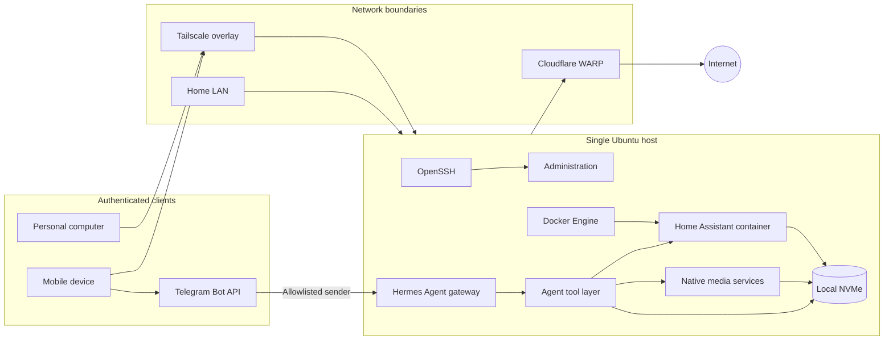

# Architecture

## Design summary

The homelab consolidates automation, media, and network-access workloads on one repurposed Ubuntu laptop. The current design favors low hardware cost and simple day-to-day administration over high availability.

There are three principal trust zones:

1. **Physical LAN** — the server connects to the home router over Wi-Fi.
2. **Tailscale overlay** — authenticated personal devices can reach the server through an encrypted private network.
3. **Outbound tunnel** — Cloudflare WARP provides an additional outbound network path.
4. **Agent control plane** — Telegram messages cross an external messaging boundary before Hermes can invoke local tools.

No public inbound route was identified during discovery. That is an observation of the host, not a guarantee about upstream router configuration.

## Component view

## Deployment model

The system currently uses a mixed deployment model:

- Home Assistant runs in Docker with host networking.
- Hermes Agent runs continuously as an enabled systemd user service and receives commands through Telegram.
- Jellyfin and supporting media-library tools run directly under the primary Linux user.
- SSH, Docker, Tailscale, WARP, and unattended upgrades run as system services.
- LXD is installed but has no initialized workloads.

The reproducibility target is a sanitized declarative baseline that captures image versions, mounts, restart policy, and service dependencies without committing secrets. Live deployment files and paths remain private.

## Data and control flows

| Flow | Purpose | Boundary crossed |
| --- | --- | --- |
| Personal device → Tailscale → server | Remote administration and private service access | Authenticated overlay to host |
| Telegram → Hermes gateway | Conversational commands and responses | External messaging platform to local agent |
| Hermes → model provider | Inference requests and responses | Local agent to external API |
| Hermes → local tools | Host, file, web, scheduling, and automation actions | Agent decision to operating-system capability |
| LAN client → service endpoint | Local automation and media access | Home LAN to application |
| Home Assistant → local devices | Device discovery and automation | Container host network to LAN |
| Media service → local NVMe | Library metadata and content access | Process to local filesystem |
| Administrator → SSH | Operating-system management | LAN or tailnet to privileged control plane |

## Availability model

All workloads share one host, one system disk, one Wi-Fi link, and one power source. The server demonstrated strong practical uptime during discovery, but any of those shared dependencies can stop every service.

Hermes also concentrates control authority. A compromised Telegram identity, bot token, model interaction, or tool policy could affect multiple services through one control plane. Its availability and authorization therefore sit above the individual applications in the dependency graph.

The current recovery model is rebuild-oriented rather than highly available. The roadmap prioritizes configuration capture and tested off-host backups before adding more services.

## Constraints

- Consumer laptop hardware and cooling
- Wi-Fi rather than wired Ethernet
- Single internal disk
- No dedicated orchestration platform
- No confirmed off-host backup target
- Portfolio documentation must remain useful without exposing live identifiers
