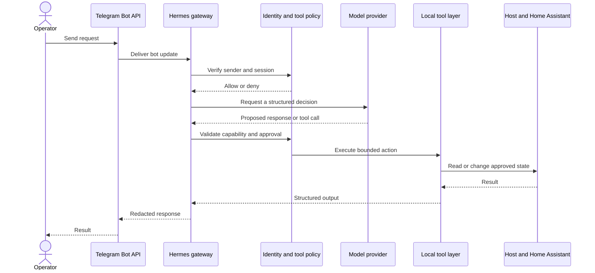

# Hermes Agent control plane

## Role in the homelab

Hermes Agent is the homelab's conversational control plane—the “brain” connecting a mobile Telegram interface to local tools, services, and automation. Instead of opening several dashboards for routine requests, the operator can send a message and let Hermes coordinate the relevant workflow.

The active deployment was verified as an enabled systemd user service with automatic restart. It runs under the primary non-root account and has remained active since June 2026. An alternate Docker Compose definition exists for gateway and dashboard components, but it was not the active runtime observed during discovery.

## Request flow

The policy checks shown above are the target security model. Live policy details and remediation status are intentionally not published.

## Confirmed deployment properties

| Property | Observed state |
| --- | --- |
| Service manager | systemd user service |
| Lifecycle | Enabled, active, automatic restart |
| Runtime identity | Non-root user |
| Messaging interface | Telegram bot |
| Sender scope | Explicit allowlist; identities withheld |
| Messaging destination | Configured; identifiers withheld |
| State | Local database, cache, and session artifacts |
| Secret storage | Owner-only environment/authentication files inside an owner-only directory |
| Implementation | NousResearch Hermes Agent repository |

No token, user ID, channel ID, conversation content, model credential, OAuth artifact, or state-database content was read or copied into this repository.

## Capability model

The installed Hermes codebase includes tools for terminal commands, files, browser and web tasks, scheduled jobs, memory, messaging, and Home Assistant. Presence in the installed package does not prove that every capability is enabled in the current policy.

For portfolio purposes, capabilities fall into three classes:

| Class | Examples | Default handling target |
| --- | --- | --- |
| Read-only | Health checks, inventory, status summaries | Allow within bounded paths and time limits |
| Reversible mutation | Restarting an approved service, updating a task, changing a known automation | Require explicit scope and record an audit event |
| Consequential | Shell mutation, package changes, credential access, account changes, deletion | Require confirmation or deny entirely |

## Security boundary

The Telegram allowlist answers “who may send a command?” It does not answer “what may that command cause?” A secure control plane needs independent enforcement at each layer:

- Telegram identity and bot-token protection
- Session isolation and safe unauthorized-message behavior
- Prompt-injection resistance for messages and retrieved content
- Model-output validation before tool dispatch
- Tool, path, host, and network allowlists
- Confirmation for consequential actions
- A dedicated service identity without privileged groups
- Systemd sandboxing and resource limits
- Secret filtering for model context, logs, and Telegram responses
- Auditable correlation from request to tool result

## Security engineering focus

- Keep Telegram sender authorization explicit and narrow.
- Run the gateway under a dedicated, least-privilege service identity.
- Protect secret-bearing configuration and local state with owner-only access.
- Apply compatible systemd sandboxing and resource limits.
- Constrain the installed tool surface with allowlists and confirmation gates.
- Maintain explicit privacy, backup, retention, and deletion rules for agent state.
- Treat unauthorized-message behavior as a deny-by-default policy decision.
- Correlate approved requests with redacted, tamper-resistant tool audit events.
- Retain Tailscale and SSH as an independent recovery path.

The hardening objective is not to make Hermes powerless. It is to preserve useful orchestration while ensuring each tool has only the authority required for its job.

The architectural rationale is captured in [ADR-001: Use Hermes Agent with Telegram as the homelab control plane](decisions/001-hermes-telegram-control-plane.md).
