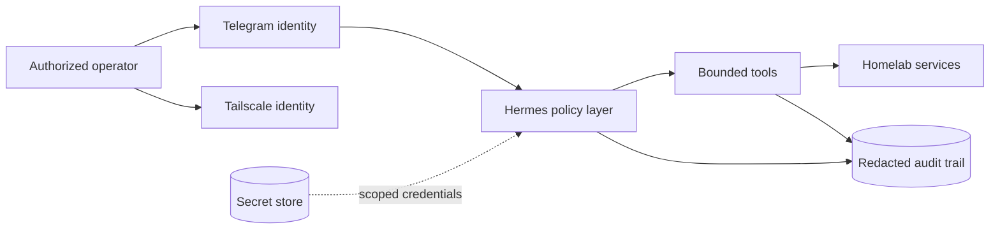

# Security architecture

## Publication boundary

This public document describes the intended security model and engineering principles, not live control status. Exact listener bindings, firewall rules, account settings, device identities, patch state, backup destinations, and remediation status are deliberately excluded.

The assessment behind this repository was performed read-only over SSH. No credential values, application databases, conversation content, private service configuration, or authentication artifacts were collected.

## Defense model

The design uses independent controls at each boundary:

- Tailscale provides identity-aware private connectivity for direct administration.
- SSH keys provide a separate recovery and maintenance path.
- Telegram sender controls limit access to the conversational interface.
- Hermes tool policy determines what an accepted request may do.
- Service-specific credentials limit downstream authority.
- Redacted audit events connect requests, approvals, tools, and outcomes.

## Hermes threat model

| Threat | Relevant boundary | Design control |
| --- | --- | --- |
| Sender spoofing or account takeover | Telegram user → bot | Explicit sender allowlist, strong account security, token-rotation procedure |
| Prompt injection | Messages, web results, files, and tool output → model | Treat retrieved content and model output as untrusted; enforce policy outside prompts |
| Excessive agency | Agent → terminal, files, and Home Assistant | Least-privilege identity, tool/path allowlists, and confirmation for consequential actions |
| Information disclosure | Local state → Telegram or model provider | Secret filtering, minimal context, protected state, and redacted logs |
| Repudiation | Telegram command → tool action | Correlated audit records without secret-bearing payloads |
| Unbounded consumption | Telegram → agent loop and providers | Rate, time, token, concurrency, and recursion limits |

Telegram authorization answers “who may ask?” Tool authorization independently answers “what may happen?” Keeping those decisions separate prevents a compromised messaging identity from automatically becoming unrestricted host administration.

## Host baseline

The target host baseline includes:

- Default-deny inbound firewall policy with narrow LAN and tailnet allowances
- Key-only SSH, no direct root login, and a tested local-console recovery path
- Automated security updates with a defined reboot and verification cadence
- Least-privilege service identities with no unnecessary administration groups
- Declarative service definitions, pinned versions, and health checks
- Encrypted off-host backups with routine restore exercises
- Bounded journal retention and external failure alerts

Live values and completion state are maintained privately.

## Agent control-plane baseline

- Dedicated Hermes service identity
- Explicit tool, filesystem, host, and destination allowlists
- Confirmation gates for mutations and consequential actions
- systemd restrictions such as `NoNewPrivileges`, filesystem protection, private temporary storage, and resource limits where compatible
- Safe handling of unauthorized messages and session separation
- Bot/API token rotation and owner-only secret storage
- Model output validation before tool dispatch
- Tamper-resistant, redacted audit events

## Repository redaction policy

The portfolio may describe technologies, trust zones, standard protocols, and design controls. It must not publish:

- LAN, public, WARP, or tailnet addresses
- DNS names, account names, user identities, channel IDs, or device keys
- Machine, boot, MAC, or storage identifiers
- Firewall source ranges, router settings, or live listener bindings
- Current remediation status or exploitable configuration gaps
- Environment variables, tokens, passwords, certificates, private keys, or OAuth artifacts
- Raw inventory output, application databases, logs, or conversation content
