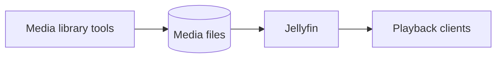

# Services

## Application inventory

| Service | Runtime | State observed | Role |
| --- | --- | --- | --- |
| Hermes Agent | systemd user service | Enabled and continuously running | Agent orchestration and Telegram control plane |
| Home Assistant | Docker, host network | Running continuously for roughly three months | Home automation platform |
| go2rtc | Home Assistant companion process | Running | Camera and real-time stream transport |
| Jellyfin | Native user process | Running | Media library and streaming |
| Media library tooling | Native user processes | Running | Library organization and supporting automation |

## Infrastructure inventory

| Service | Management | Role |
| --- | --- | --- |
| Docker Engine | systemd | Container runtime |
| containerd | systemd | Low-level container lifecycle |
| OpenSSH | systemd | Administrative access |
| Tailscale | systemd | Private mesh networking |
| Cloudflare WARP | systemd | Outbound network tunnel |
| unattended-upgrades | systemd | Automatic security/package maintenance |
| systemd-resolved | systemd | Local DNS resolution |
| journald and rsyslog | systemd | System logs |

## Hermes Agent

Hermes Agent is the primary interaction and orchestration layer for the homelab. A Telegram gateway receives commands from an allowlisted user, passes them into the agent runtime, and returns results through the same conversational interface. The service maintains local state and can coordinate supported tools such as terminal execution, file operations, web research, scheduled jobs, memory, and Home Assistant integration.

The deployed gateway runs persistently under the non-root account with automatic restart. A Docker Compose definition also exists for gateway and dashboard services, but the observed active deployment is the systemd user service. Configuration values and tokens remain outside this repository.

See [Hermes Agent control plane](hermes-agent.md) for its trust boundaries and hardening plan.

## Home Assistant

Home Assistant is the only active Docker workload. It uses the upstream stable image and host networking. Host networking simplifies local device discovery and multicast-based integrations, but it also removes container-level port isolation. The host firewall and application authentication therefore become especially important boundaries.

The container was discovered without an associated Docker Compose project or named Docker volume. Before rebuilding or upgrading it, the exact bind mounts and restart policy should be captured into a sanitized declarative definition.

## Media stack

Jellyfin and the supporting media-library tools currently run as processes owned by the primary non-root account. They are not exposed as detected system-wide systemd units. This suggests they were started through a user session, shell automation, or another user-level mechanism.

The portfolio-safe service relationship is:

This diagram records functional relationships, not proof of every configured API connection. Secret-bearing application configuration was intentionally excluded from discovery.

## Lifecycle design

- Persistent applications should have declarative launch definitions.
- Container images should use deliberate versioning and documented update procedures.
- Every long-running service should expose a health signal and recovery behavior.
- Temporary services should be removed when no longer required.
- Persistent data locations need an explicit backup and restore matrix.
